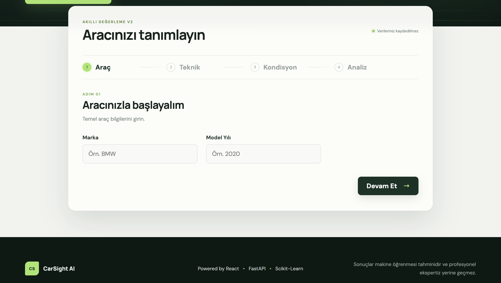

# CarSight AI

CarSight AI is an end-to-end machine learning vehicle valuation platform. It predicts second-hand vehicle prices with a production Scikit-learn Pipeline, serves predictions through FastAPI, and provides a responsive React and TypeScript valuation experience.

The current v2 model evaluates 13 raw vehicle attributes and returns an estimated price in Turkish lira. Results are estimates derived from the training data; they are not professional appraisals or live marketplace quotes.

## Live Links

| Resource          | URL                                                                          |
| ----------------- | ---------------------------------------------------------------------------- |
| Live demo         | _Production Vercel URL is not recorded in this repository yet._              |
| API documentation | [carsight.onrender.com/docs](https://carsight.onrender.com/docs)             |
| Backend health    | [carsight.onrender.com/health](https://carsight.onrender.com/health)         |
| GitHub repository | [github.com/selcanakturk/carsight](https://github.com/selcanakturk/carsight) |

## Screenshots

### Landing Page

<p align="center">
  
</p>

### Vehicle Valuation Flow

<p align="center">
  
</p>

## Features

- Vehicle valuation from 13 raw vehicle attributes
- Tuned Random Forest regressor packaged with preprocessing in a fitted Scikit-learn Pipeline
- Four-step responsive flow: Araç, Teknik, Kondisyon, and Analiz
- FastAPI REST endpoint with Pydantic request validation
- Swagger/OpenAPI documentation
- Deterministic, rule-based AI-style result insights
- Loading, validation, API error, and responsive UI states
- Safe backend model loading and inference error handling
- Production CORS configuration for local and hosted frontends
- Render backend and Vercel-ready frontend configuration
- Automated backend tests

## Machine Learning

The project workflow covers exploratory data analysis, cleaning, feature engineering, baseline modelling, Random Forest training, hyperparameter tuning, model comparison, global feature-importance analysis, and model serialization.

V2 expands the original six-feature model to 13 raw inputs. Its fitted Pipeline keeps inference reproducible by applying the same numeric conversion, missing-value handling, and categorical encoding used during training before invoking the tuned Random Forest regressor.

### Model Performance

| Model                      |   MAE (TRY) |  RMSE (TRY) |        R² |
| -------------------------- | ----------: | ----------: | --------: |
| Linear Regression baseline |     358,176 |     737,938 |     0.236 |
| Initial Random Forest      |     157,289 |     556,297 |     0.566 |
| Tuned Random Forest v1     |     154,633 |     543,453 |     0.586 |
| **Production v2 Pipeline** | **104,919** | **317,510** | **0.859** |

Lower MAE and RMSE indicate smaller prediction errors; higher R² indicates that the model explains more variance in the held-out test set. Compared with tuned v1, v2 reduced MAE by approximately 32% and RMSE by approximately 42%, while increasing R² by about 0.273.

### V2 Inputs

The production Pipeline receives these raw training columns:

- `marka`
- `yıl`
- `kilometre(Km)`
- `vitesTipi`
- `yakitTuru`
- `kasaTipi`
- `motorGucu(HP)`
- `motorHacmi(Cc)`
- `cekisTipi`
- `orjinal_parça_sayısı`
- `lokal_boyalı_parça_sayısı`
- `boyalı_parça_sayısı`
- `değişen_parça_sayısı`

### Global Feature Importance

The leading v2 global feature importances are engine power, model year, mileage, and engine displacement. These values describe how the fitted model used features across the training data. They do not establish real-world causal relationships and should not be interpreted as local explanations for an individual prediction.

## Architecture

```text
React + TypeScript
        ↓
POST /api/predict
        ↓
FastAPI + Pydantic
        ↓
Scikit-learn Pipeline
        ↓
Preprocessing
        ↓
Random Forest Regressor
        ↓
Predicted Price
        ↓
Rule-based AI Insights
```

The backend accepts validated API-friendly field names, maps them to the Pipeline's raw training schema, and submits a one-row Pandas DataFrame to the serialized Pipeline. The frontend displays the returned price and generates deterministic explanatory insights from the submitted vehicle attributes.

## Tech Stack

| Area             | Technologies                                        |
| ---------------- | --------------------------------------------------- |
| Frontend         | React, TypeScript, Vite, CSS                        |
| Backend          | FastAPI, Pydantic, Pandas, Uvicorn                  |
| Machine learning | Scikit-learn, Random Forest, NumPy, Joblib, Jupyter |
| Testing          | Pytest, FastAPI TestClient                          |
| Deployment       | Render, Vercel                                      |

## Project Structure

```text
CarSight/
├── backend/
│   ├── app/
│   │   ├── routes/
│   │   ├── services/
│   │   ├── main.py
│   │   └── schemas.py
│   ├── tests/
│   ├── .env.example
│   ├── requirements.txt
│   └── requirements-dev.txt
├── data/
│   ├── raw/
│   └── processed/
├── docs/
│   ├── ARCHITECTURE.md
│   ├── DEPLOYMENT.md
│   ├── PRD.md
│   └── ROADMAP.md
├── frontend/
│   ├── src/
│   │   ├── components/
│   │   ├── services/
│   │   ├── utils/
│   │   └── App.tsx
│   ├── .env.example
│   └── package.json
├── ml/
│   └── transformers.py
├── models/
│   └── random_forest_model.pkl
├── notebooks/
│   ├── 01_eda.ipynb
│   ├── ...
│   └── 12_feature_expansion.ipynb
├── render.yaml
└── README.md
```

## API Usage

### `POST /api/predict`

The public endpoint is:

```text
https://carsight.onrender.com/api/predict
```

Example request with all 13 required API fields:

```json
{
  "marka": "BMW",
  "yıl": 2020,
  "kilometre_Km": 80000,
  "vitesTipi": "Otomatik",
  "yakitTuru": "Dizel",
  "kasaTipi": "Sedan",
  "motorGucu_HP": "126 - 150 HP",
  "motorHacmi_Cc": "1401 - 1600 cm3",
  "cekisTipi": "Arkadan İtiş",
  "orjinal_parça_sayısı": 10,
  "lokal_boyalı_parça_sayısı": 1,
  "boyalı_parça_sayısı": 1,
  "değişen_parça_sayısı": 1
}
```

Example response:

```json
{
  "predicted_price": 1592092,
  "currency": "TRY"
}
```

The exact prediction depends on the submitted attributes and production model version.

## Local Development

### Backend

Create the virtual environment and install dependencies from the repository root if they are not already available:

```bash
python3 -m venv backend/.venv
backend/.venv/bin/pip install -r backend/requirements-dev.txt
```

Start FastAPI:

```bash
cd backend
.venv/bin/uvicorn app.main:app --reload
```

The API is available at `http://127.0.0.1:8000`, with Swagger at `http://127.0.0.1:8000/docs`.

### Frontend

```bash
cd frontend
npm install
npm run dev
```

Vite serves the application at `http://localhost:5173` by default.

Copy values from the existing example files when environment configuration is needed:

- `backend/.env.example` documents `FRONTEND_ORIGINS`.
- `frontend/.env.example` documents `VITE_API_BASE_URL` and the local `/backend` proxy.

Do not commit local `.env` files.

## Testing

Run the complete backend suite from the repository root:

```bash
cd backend
.venv/bin/python -m pytest -q
```

Current verified status: **22 passed**.

Build the production frontend with:

```bash
cd frontend
npm run build
```

## Deployment

- **Render:** hosts the FastAPI service using the root-level `render.yaml`. The service uses `/health` for health checks and loads the production model from `models/random_forest_model.pkl`.
- **Vercel:** builds the Vite application from `frontend/` and publishes `frontend/dist`.
- **`VITE_API_BASE_URL`:** must point to the Render service origin, such as `https://carsight.onrender.com`.
- **`FRONTEND_ORIGINS`:** must contain the exact permitted Vercel frontend origin or origins as a comma-separated allowlist.

See [docs/DEPLOYMENT.md](docs/DEPLOYMENT.md) for complete build, start, environment, and post-deployment verification instructions.

## Limitations

- Prediction quality depends on the scope, quality, and distribution of the training dataset.
- Output prices are model estimates, not professional appraisals or guaranteed transaction prices.
- The application does not currently perform real-time marketplace or comparable-listing analysis.
- AI insights are deterministic rule-based explanations, not SHAP values, local causal explanations, or evidence of causality.

## Roadmap

- [ ] Add SHAP-based local prediction explanations
- [ ] Estimate prediction intervals or uncertainty
- [ ] Compare predictions with current marketplace listings
- [ ] Explore vehicle-image damage analysis
- [ ] Add saved valuation history
- [ ] Generate downloadable PDF valuation reports

## Author and License

Project repository: [selcanakturk/carsight](https://github.com/selcanakturk/carsight)

No license file is currently included in this repository. All rights remain with the project author unless a license is added.
